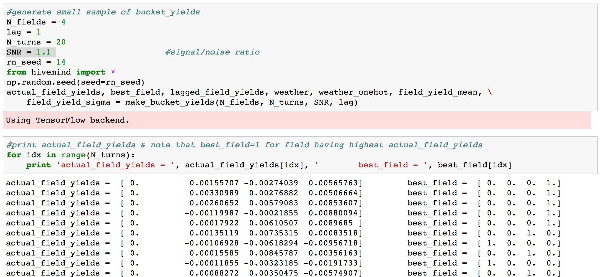
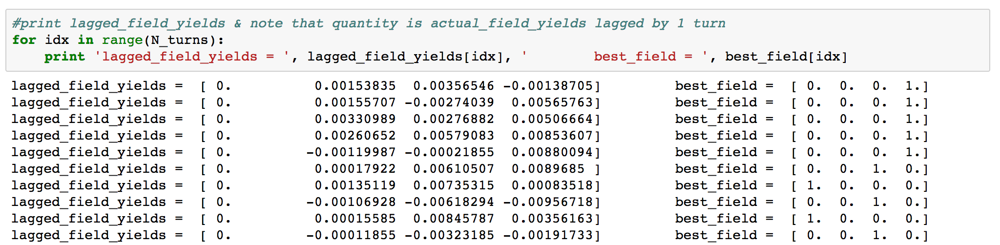

# hivemind

by Joe Hahn, 
jmh.datasciences@gmail.com, 
7 March 2018 
git branch=master

### Summary:
Train the hivemind, which is a very simple neural net, to send its bees towards the more
productive fields and to avoid less rewarding fields.

### Setup:

Clone this repo:

    git clone https://github.com/joehahn/hivemind.git
    cd hivemind

I am executing hivemind on a Mac laptop where I've installed
Anaconda python 2.7 plus additional libraries via:

    wget https://repo.continuum.io/miniconda/Miniconda2-latest-MacOSX-x86_64.sh
    chmod +x ./Miniconda2-latest-MacOSX-x86_64.sh
    ./Miniconda2-latest-MacOSX-x86_64.sh -b -p ~/miniconda2
    ~/miniconda2/bin/conda install -y jupyter
    ~/miniconda2/bin/conda install -y keras
    ~/miniconda2/bin/conda install -y seaborn
    ~/miniconda2/bin/conda install -y scikit-learn

### Execute:

Start Jupyter notebook via

    jupyter notebook

and load the hivemind.ipynb notebook then click Kernel > Run All

### Generate game data:

Hivemind is a turn-based game, each turn the hivemind chooses which fields that it will
direct its numerous bees. To illustrate, play a tiny game using 4 fields and lasting 20 turns:
 

Each line in the above shows each of the 4 bucket's fractional yields for the first 9 turns.
The leftmost field zero always produces a zero yield while the other fields produce
positive or negative yields, while the 4 rightmost values is a onehot-encode of the field
having the highest yield.

Of course the hivemind does not know in advance which field will have the highest yield,
but it will know will which field was most productive during the previous turn,
and this is the majority of the game data that the hivemind will be trained:
 

Field yields are also influenced by the weather, which can be nominal, stormy, or hot,
with yields being smaller or more negative when the weather is stormy or hot:
 

Every turn all fields' yields are randomly drawn from a normal distribution whose
mean and standard-deviation both increase linearly with field number:
 
So when the weather is 'nominal', the higher-numbered fields are more productive
since their mean yield is higher. But higher-numbered fields are also have noisier yields
since their standard-deviation is also higher, in fact all fields' yields have a 
signal/noise ratio of about 1.

The purpose of this demo is to train a neural net to advise the hivemind to direct
its bees towards the most productive fields. But before we do that, lets pre-program
the hivemind to follow 4 different human-generated strategies. The most conservative
strategy is the 'low' strategy which directs all bees to the lowest one-third of all
fields, these fields have low yields and the least noise. Also there is the 'middle'
strategy which directs bees towards random selections from the middle third of all fields.
And when the 'high' strategy is used, all bees are sent to the uppermost third of fields;
these fields are the most productive though they are also the noisiest. At each
turn we also compute the net_value that is generated when these bes gather pollen from
their respective fields and return to the hive; that net_value is simply the product of
1+ each field's fractional yield X fraction of bees sent that

, which does depend on the weather because
the upper-third of all fields tend to have
