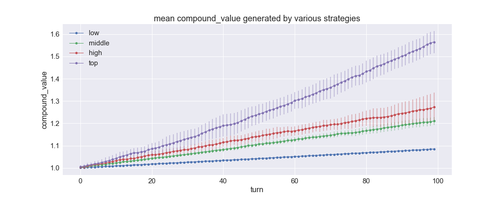
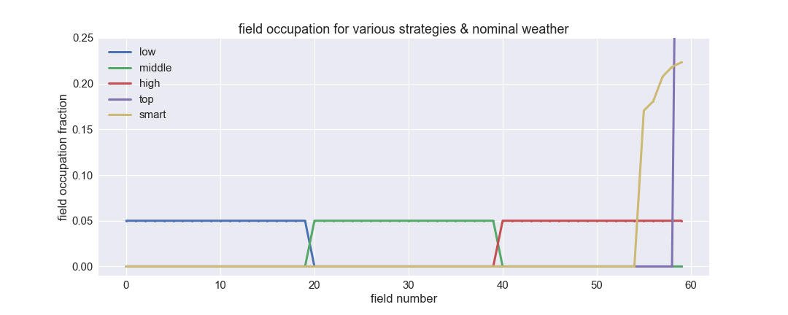
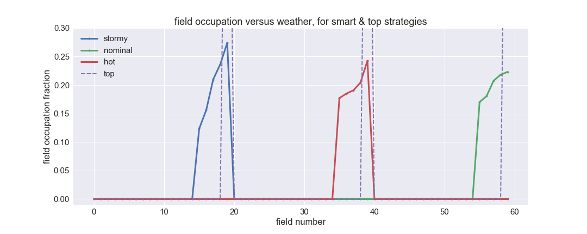

# hivemind

by Joe Hahn, 
jmh.datasciences@gmail.com, 
7 March 2018 
git branch=master

### Summary:
Train the hivemind, which is a very simple neural net, to send its bees towards the more
productive fields and to avoid less rewarding fields.

### Setup:

Clone this repo:

    git clone https://github.com/joehahn/hivemind.git
    cd hivemind

I am executing hivemind on a Mac laptop where I've installed
Anaconda python 2.7 plus additional libraries via:

    wget https://repo.continuum.io/miniconda/Miniconda2-latest-MacOSX-x86_64.sh
    chmod +x ./Miniconda2-latest-MacOSX-x86_64.sh
    ./Miniconda2-latest-MacOSX-x86_64.sh -b -p ~/miniconda2
    ~/miniconda2/bin/conda install -y jupyter
    ~/miniconda2/bin/conda install -y keras
    ~/miniconda2/bin/conda install -y seaborn
    ~/miniconda2/bin/conda install -y scikit-learn

### Execute:

Start Jupyter notebook via

    jupyter notebook

and load the hivemind.ipynb notebook then click Kernel > Run All

### Generate game data:

Hivemind is a turn-based game, and during each turn the hivemind must determine to which
of the available fields that the hivemind will send its many bees to.
To illustrate, play a tiny game using 4 fields lasting 20 turns:
 

Each line in the above shows each of the 4 bucket's fractional yields for the first 10 turns.
The leftmost column, which corresponds to field number zero,
always generates a zero yield while the other fields produce
positive or negative yields, while the 4 rightmost columns give the onehot-encode for the field
having the highest yield each turn.

Of course the hivemind does not know in advance which field will have the highest yield,
but it will know will which field was most productive during the previous turn,
and the following shows the majority of game data that the hivemind will be trained on:
 

Field yields are also influenced by the weather, which can be 'nominal', 'stormy', or 'hot',
with yields being smaller or more negative when the weather is stormy or hot:
 

Every turn, all fields' yields are randomly drawn from a normal distribution whose
mean and standard-deviation both increase linearly with field number:
 
So when the weather is 'nominal', the higher-numbered fields are more productive
since their mean yield is higher. But higher-numbered fields also have noisier yields
since their standard-deviation is also higher, and in fact all fields' yields have a 
signal/noise ratio of about 1.

The purpose of this demo is to train a neural net to advise the hivemind to direct
its bees towards the most productive fields. But before we do that, lets pre-program
the hivemind to follow 4 different human-generated strategies. The most conservative
strategy is the 'low' strategy which directs all bees to the lowest one-third of all
fields, these fields have low yields, the least noise, and they are unaffected by the weather.
And there is also the 'middle' strategy which directs bees towards random selections
from the middle third of all fields.
And when the 'high' strategy is used, all bees are sent to the uppermost third of fields;
these fields are the most productive though they are also the noisiest. At each
turn we also compute the hive's net_value, which grows as these bees gather pollen from
their respective fields that they then return to the hive; that net_value is simply the product of
1+ each field's fractional yield times the fraction of bees sent to each field. The following
table shows after turn zero is completed, the hive's 
net value = (1+0.002406)\*0.5 + (1+0.013708)\*0.5 = 1.008057 when the 'high' strategy
is played, which sends 50% of all bees to field number 4 (prob4=0.5 tells us that 50%
of the hive's bees were sent to field 4) and 50% to field number 5 (ie prob5=0.5).
And after turn 1 is completed, the hive then accrues another net value of 1.007119, and the table
below shows that the hive's compound_value=1.008057*1.007119 = 1.015233, with
compound-scoring used to quantify how visits by bees at the more productive fields
tends to strengthen the hive over time such that it spawns greater number of healthier bees.
 
Note also that the weather was hot during turn 3, which greatly reduces the yields
generated by the game's upper one-third of all fields (ie fields 4 & 5). Likewise
yields are reduced across the game's upper two-thirds of fields when the weather is 'stormy'.
This then suggests another game-play strategy,
known as the  'top' strategy, which sends all bees
to the topmost field when the weather is 'nominal', and sends all bees to field 1
(which is the most productive field in this game's lower-one-third of all fields) when the weather
is 'stormy', and field 3 (the most productive field in this game's middle-third) when
the weather is 'hot'.

Next, play numerous larger games of hivemind, these larger
games will use 60 fields and last 100 turns.
For each of the four strategies described above ('low', 'middle', 'high', and 'top), play 10 games,
and the following chart shows the average compound_value generated by each strategy:
 
As expected, the 'top' strategy results in higher compound_value when compared to games
that use the other strategies.

### Train neural net to play hivemind:

Now train a simple MLP neural net classifier to recommend to the hivemind how it should
deploy its bees every turn. Start by generating lots of training data by playing a single
game lasting 10^5 turns, this generates a volume of game data that is 100x larger than
that shown above. The MLP model will be trained on features

    x = lagged_field_yields + weather_onehot

to predict the target variable

    y = best_field

which is the field that was most productive each turn, onehot encoded. This game data is then
split equally into train, test, and validation datasets. Keras + Tensforflow
is then used to build a very simple Multi Layer Perceptron classifier,
https://github.com/joehahn/hivemind/blob/master/hivemind.py#L93#L102:
 
The model is then trained, and the following plot of the training and validation loss
shows that the trained model does not suffer any over- or under-fitting:
 
The output of the MLP classifier is the predicted probability that a given field 
will generate the highest yield. Which suggests the following strategy:
have the hivemind send its bees to all fields in proportion to the predicted
probability. Which was a partial success...the hive's resulting compound_value
was higher than that generated by the 'high' strategy but less than that generated by
the 'top' strategy. But an easy fix is to instead send all bees in proportion
to the top_k=5 fields having the highest predicted scores,
this modified strategy is called the 'smart' strategy and the compound_value
generated by the 'smart' strategy is indicated by the gold curve below,
the 'smart' strategy is almost as performant as the human-encoded 'top' strategy: 
 

How the hivemind distributes its bees across all fields is shown below,
for each strategy during turns of 'nominal' weather:
 
so the blue curve shows that all bees occupy the lower-one-third of fields
when the 'low' strategy is employed, the middle-one-third of fields
are occupied when the 'middle' strategy is used (green curve). Red curve
shows that the upp-one-third of fields are occupied when 'high' strategy
is used, and the gold curve shows that the trained MLP model did in fact
learn to direct all bees to the most productive top_k=5 fields
during turns having 'nominal' weather.

Also keep in mind that the most productive field changes with weather,
and the following shows that the trained hivemind did indeed learn
to send its bees to the top_k=5 of the lower-one-third fields when
the weather is 'stormy' (blue curve), and to the top_k=5 members of the
middle-one-third of fields when the weather is 'hot' (red curve):
 

### Findings:

The above shows how the class probabilities computed by a traditional
classifier can be used to automate the decision-making that code 
would need to play a simple game. During an earlier attack on the hivemind problem,
I had attempted to use reinforcement learning---specifically Q-learning---but
the gameplay strategies learned by the much more complicated Q-learning algorithm
were mediocre at best, likely because the rewards generated during a hivemind game
are very noisy. Replacing fancy Q-learning with a simple classifier lets the
trained model spot the signal by averaging across all the noise in the
rewards, and results in wiser gameplay.
